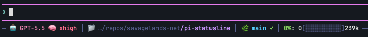

# @savagelands-net/pi-statusline

A polished statusline extension for [Pi](https://github.com/earendil-works/pi-coding-agent), maintained by **savagelands-net**.

This package is a fork of [`@wierdbytes/pi-statusline`](https://www.npmjs.com/package/@wierdbytes/pi-statusline). The upstream package provided the modular Tokyo Night styled statusline foundation; this fork keeps that base and adds the layout, prompt, icon, and npm-package polish we wanted for our Pi setup.



## What this fork adds

Compared with the upstream `@wierdbytes` package, this fork adds:

- **Published package identity** — npm package, GitHub repo, and docs now live under `@savagelands-net/pi-statusline`.
- **Below-prompt statusline placement** — the statusline defaults to rendering below the prompt/editor instead of above it.
- **Configurable placement** — switch between above-editor, below-editor, and status output with `/statusline placement ...`.
- **Prompt divider behavior** — the editor bottom border stays visible and acts as the divider when the statusline is below the prompt.
- **Powerline-style prompt prefix** — editor input starts with a clean `❯` marker and continuation lines align underneath it.
- **Folder icon in the path block** — the cwd segment has a matching icon for the active icon set.
- **Git branch icon** — the git block now includes an icon, branch name, and clean/dirty state.
- **Expanded icon sets** — choose Nerd Font, plain Unicode, ASCII, minimal, or emoji styles.

## Screenshot

Use this path for the package screenshot:

```text
assets/demo.png
```

Put the new screenshot in the repo at:

```text
~/repos/savagelands-net/pi-statusline/assets/demo.png
```

Name it exactly `demo.png`, replacing the old upstream screenshot. The README, GitHub page, npm package, and package manifest already include `assets/**`, so no other path changes are needed.

## Install

```bash
pi install npm:@savagelands-net/pi-statusline
```

Then restart Pi or reload packages:

```text
/reload
```

## Quick start

```text
/statusline on
/statusline off
/statusline toggle
/statusline
```

`/statusline` opens the settings overlay where you can configure display options, icon style, block layout, and block-specific settings.

## Statusline blocks

Each block only appears when relevant, and block order/visibility is configurable.

- **Model** — active model name, with optional inline thinking level.
- **Path** — folder icon plus the last cwd segments, with the current folder highlighted.
- **Git** — git icon, branch name, and clean/dirty marker.
- **Context** — usable context percentage with a progress bar.
- **Cost** — session cost when greater than zero.
- **Tokens** — input, output, cache-read, and cache-write counters with individual sub-toggles.
- **Stash** — saved prompt count from the editor stash history.
- **Subagents** — active/queued subagent summary when a compatible subagents extension is loaded.

## Layout

The statusline ships with reorderable blocks:

```text
model > path > git > context > cost > tokens > chips > stash
```

Open the settings overlay with:

```text
/statusline
```

In the **Layout** tab:

- `space` toggles the selected block.
- `alt+↑` / `alt+↓` moves the selected block.
- `enter` opens block-specific sub-settings for blocks that have them.

Command-line layout controls are also available:

```text
/statusline layout
/statusline layout reset
/statusline layout toggle <block>
/statusline layout move <block> <up|down|top|bottom>
```

## Placement

This fork defaults to the below-prompt layout:

```text
/statusline placement below
```

Switch back to upstream-style placement above the editor:

```text
/statusline placement above
```

Show the current placement:

```text
/statusline placement status
```

The setting is persisted in the statusline config file.

## Prompt prefix

The editor renders a compact powerline-style prompt marker:

```text
❯ your prompt text
```

Continuation lines align under the input text, keeping multi-line prompts tidy.

## Icon sets

Switch icon styles with:

```text
/statusline icons <set>
```

Available sets:

| Set | Use when |
|---|---|
| `nerd-font` | You use a Nerd Font and want the full visual style. |
| `plain` | You want portable Unicode symbols. |
| `ascii` | You need maximum terminal/log compatibility. |
| `minimal` | You want a compact symbolic look. |
| `emoji` | You prefer the original emoji-heavy style. |

Check the current icon set:

```text
/statusline icons status
```

## Editor stash

The extension includes a prompt stash workflow:

- `Alt+S` — stash current editor text and clear the editor.
- `Alt+S` with an empty editor — restore the active stash.
- `Ctrl+Alt+S` — open the stash history picker.

The stash block shows the current stash-history depth as `📦 N` or the equivalent icon for the active icon set.

## Fixed editor cluster

Enable a fixed bottom editor/statusline cluster:

```text
/statusline fixed-editor on
```

When enabled, chat/feed content scrolls above the fixed statusline and editor. Turn it off with:

```text
/statusline fixed-editor off
```

Mouse scrolling can be controlled separately:

```text
/statusline mouse-scroll on
/statusline mouse-scroll off
```

## Subagents bridge

When a compatible subagents extension emits `subagents:*` events, this statusline can show an aggregated active/queued agents chip and toast failures or long-running completions.

```text
/statusline subagents status
/statusline subagents on
/statusline subagents off
/statusline subagents long-ms <ms>
/statusline subagents toast-failure <on|off>
/statusline subagents toast-long <on|off>
/statusline subagents toast-scheduled <on|off>
```

## Commands

```text
/statusline on
/statusline off
/statusline toggle
/statusline placement [above|below|status]
/statusline footer on|off|toggle
/statusline fixed-editor on|off|toggle
/statusline mouse-scroll on|off|toggle
/statusline events [status|log|clear|toast-ms <level> <ms>]
/statusline icons [nerd-font|plain|ascii|minimal|emoji|status]
/statusline layout [status|reset|toggle <block>|move <block> <up|down|top|bottom>]
/statusline subagents [status|on|off|long-ms <ms>|toast-failure <on|off>|toast-long <on|off>|toast-scheduled <on|off>]
```

## Configuration files

For compatibility with the upstream package, config is still stored under:

```text
~/.pi/agent/wierd-statusline/
```

Important files:

- `events.json` — display, placement, icon, layout, and event/toast settings.
- `stash-history.json` — prompt stash history.

## Development

```bash
git clone https://github.com/savagelands-net/pi-statusline.git
cd pi-statusline
npm install
npm test
```

Install a local checkout into Pi while developing:

```bash
pi install ./
```

## Credits

Forked from [`@wierdbytes/pi-statusline`](https://www.npmjs.com/package/@wierdbytes/pi-statusline) by [`@wierdbytes`](https://www.npmjs.com/~wierdbytes).

Also inspired by [`pi-powerline-footer`](https://github.com/nicobailon/pi-powerline-footer) by [`@nicobailon`](https://github.com/nicobailon).
